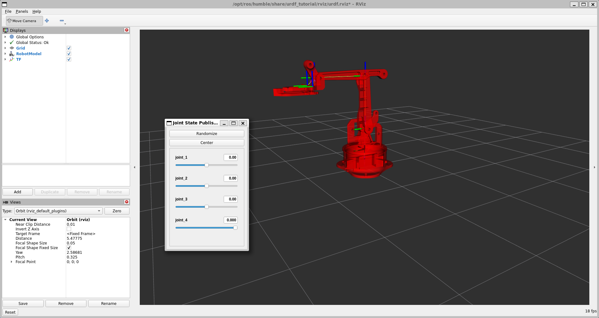
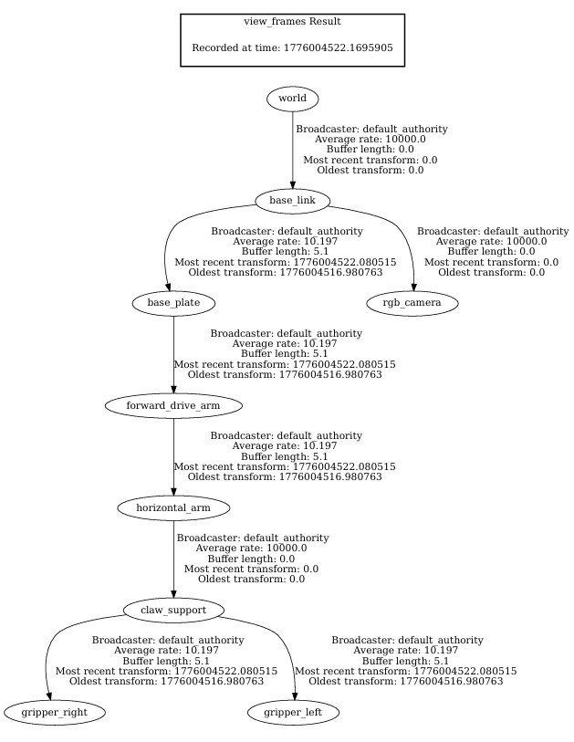
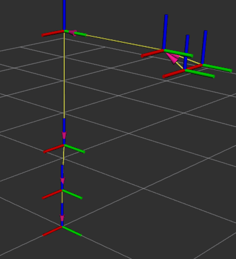

<h1 align="center">🤖 ROS2-Based 3-DOF Robotic Arm with Gripper| MoveIt2 + Gazebo Digital Twin Pipeline</h1>

<p align="center">
  ROS2 Humble • MoveIt2 • Gazebo • TF2 • URDF/Xacro • OpenCV • ros2_control
</p>

<p align="center">
 A ROS2-based robotic manipulation system implementing motion planning, control, and simulation using MoveIt2, ros2_control, and Gazebo.This project demonstrates a complete digital twin pipeline where planned trajectories in MoveIt are executed in real-time on a simulated robotic arm in Gazebo.
</p>

---

## 🎥 Project Demos

### 🦾 Arm Motion Planning + Gazebo Execution


https://github.com/user-attachments/assets/fcd272e6-22be-42c3-95cd-de1ab4f5a574


🚀 Demonstrates a complete planning-to-execution pipeline used in real-world robotic systems
### 🤏 Gripper Motion Demo


https://github.com/user-attachments/assets/66b2b837-64e9-4d77-9a32-0c9a154dee75


✔ Demonstrates synchronized motion execution between MoveIt (planning) and Gazebo (simulation)
---

## 📸 Visual Outputs

### 🧩 URDF Model with Joint Sliders GUI
<p align="center">
  
</p>

### 🌐 TF2 Frame Tree Graph
<p align="center">
  
</p>

### 📍 TF Runtime Visualization
<p align="center">
  
</p>

---

## ✨ Key Features
- ✅ 3-DOF robotic arm with gripper URDF/Xacro modeling
- ✅ RViz2 joint GUI verification
- ✅ MoveIt2 inverse kinematics + planning
- ✅ Interactive marker based end-effector control
- ✅ Gazebo synchronized execution
- ✅ Gripper open-close motion
- ✅ TF2 frame graph validation
- ✅ ros2_control integration
- 🔄 OpenCV based vision pipeline *(in progress)*
- 🔄 Real hardware synchronization *(future scope)*

---

## 🏗️ System Architecture

This project follows a modular ROS 2 pipeline:

1. **MoveIt 2** → Generates collision-aware trajectories using inverse kinematics  
2. **ros2_control** → Converts trajectories into joint-level commands  
3. **Gazebo** → Executes motion with physics simulation  
4. **TF2** → Maintains correct coordinate transformations  

👉 Represents a Digital Twin pipeline used in industrial robotic systems

## 🛠️ Tech Stack
| Category | Tools |
|---|---|
| Middleware | ROS2 Humble |
| Planning | MoveIt2 |
| Simulation | Gazebo |
| Visualization | RViz2 |
| Frames | TF2 |
| Robot Model | URDF / Xacro |
| Vision | OpenCV |
| Control | ros2_control |
| Languages | Python, C++ |
| OS | Ubuntu 22.04 |

---

## 📂 Repository Structure
```bash
robotic_arm_ros2_cv_himanshu_bugalia/
├── robotic_arm_description/
│   ├── assets/
│   ├── include/
│   ├── launch/
│   ├── meshes/
│   ├── rviz/
│   ├── urdf/
│   └── src/
│
├── robotic_arm_moveit/
│   ├── config/
│   ├── include/
│   ├── launch/
│   └── src/
│
├── roboticarm_controller/
│   ├── src/
│   ├── include/
│   ├── launch/
│   └── config/
│
├── README.md
└── .gitignore
```
## 🧠 Package Responsibilities
- **robotic_arm_description** → URDF/Xacro, meshes, RViz
- **robotic_arm_moveit** → MoveIt2 motion planning and execution pipeline
- **roboticarm_controller** → ROS2 controllers, trajectory execution, gripper control
---

## ⚙️ How to Run
```bash
cd ~/robotic_arm_ws
colcon build --symlink-install
source install/setup.bash
```

### Launch Gazebo
```bash
ros2 launch robotic_arm_description gazebo.launch.py
```
### Launch controller
```bash
ros2 launch roboticarm_controller controller.launch.py
```
### Launch MoveIt2
```bash
ros2 launch robotic_arm_moveit moveit.launch.py
```

## ⚙️ Workflow
1. Model robotic arm in **URDF/Xacro**
2. Validate DOFs in **RViz2**
3. Verify frame hierarchy using **TF2**
4. Configure **MoveIt2 motion planning**
5. Execute trajectories in **Gazebo**
6. Integrate gripper control
7. Extend toward **OpenCV based object detection**
8. Future digital twin + hardware sync

---

## 🚀 Future Scope
- 🎯 Color-based object detection
- 📦 Vision-guided pick & place
- 🤖 Physical robotic arm integration
- 🌐 Digital twin synchronization
- 📡 micro-ROS serial communication
- 🧠 AI-based object classification

---

## 👨‍💻 Author
**Himanshu Bugalia**  
Mechanical Engineering | SGSITS Indore  
Robotics • ROS2 • Computer Vision • Digital Twin
